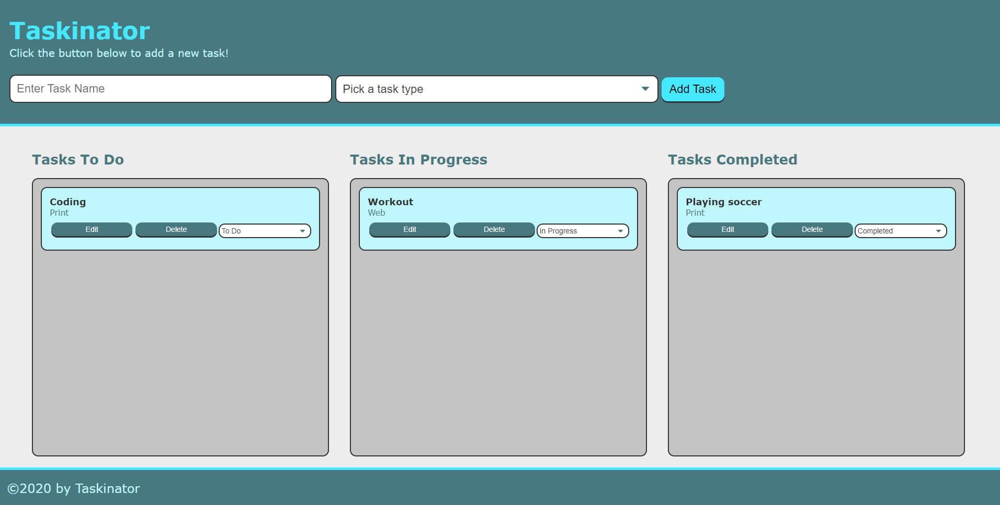

# Taskinator

## Description
A task-tracker application called the Taskinator. To succeed, you'll leverage your existing knowledge of HTML, CSS, and JavaScript front-end development. And you'll add new skills such as manipulating webpage behavior using Web APIs and the DOM.

## User story
### As a user:
A user can create tasks by entering a task name, selecting a type, and clicking an "Add Task" button.

### So that:
The user is able to organize them into Tasks To Do, Tasks In Progress, and Tasks Completed lists by using the dropdown to change the task status.

## Table of Contents
* [Local Installation](#local-installation)
* [Usage](#usage)
* [Technologies Used](#technologies-used)
* [License](#license)
* [Contributors](#contributors)
* [Screenshots](#screenshots)
* [Questions](#questions)

## Local Installation
* `Clone` the code into your machine and open in your code editor (e.g. VS Code).
*  Modify the dropdown options or any other changes in index.html according to your requirements
*  Open the application in your default browser.

## Usage
* A user is able to `Add Task` which includes `Task name` and `Task type`.
* The task is added to the `Tasks to do` list.
* The user can move the task from this field to other two fields: `Tasks in Progress` and `Tasks completed`.
* The user can edit and delete any task at any point in the application
* Once added, the task data is saved in the local storage of the browser to.

## Technologies used
)

## License

## Contributors
- [Jatin Saini](https://github.com/jatin1211)

## Screenshots

## Questions
If you have any question, please email me at: sainijatin247@gmail.com 